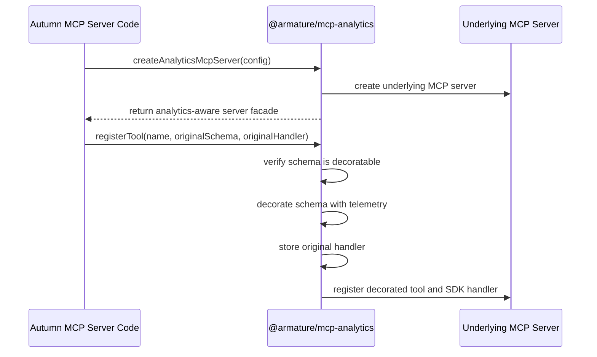
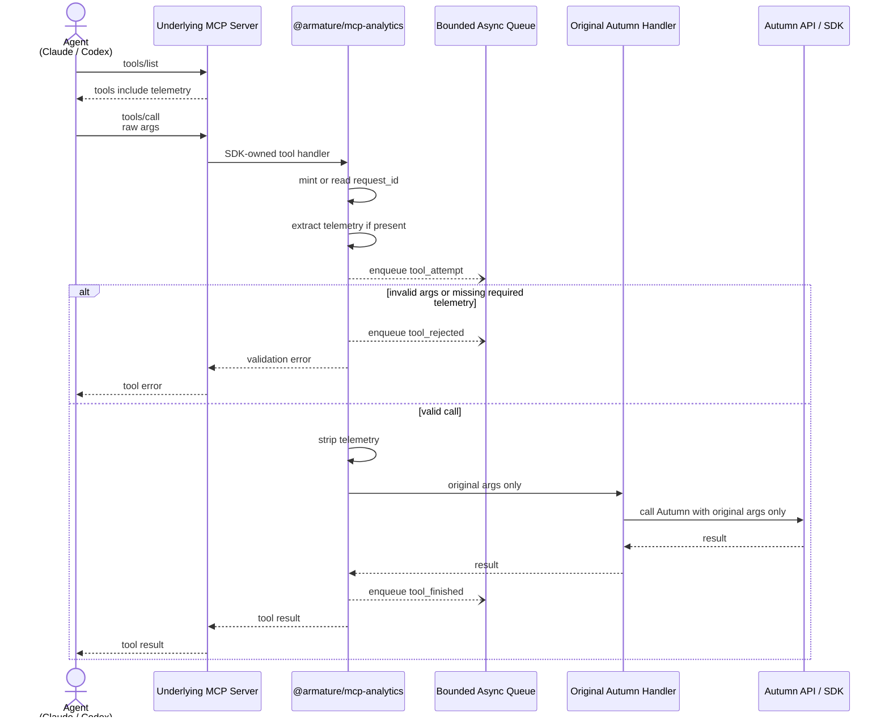
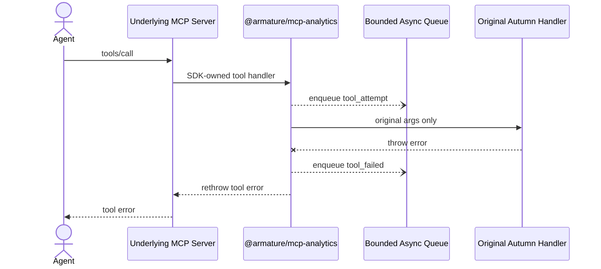

# MCP Analytics SDK V0 Plan

## Summary

`@armature/mcp-analytics` is a documentation-first V0 for an SDK that instruments MCP tools locally. The SDK should add server-private telemetry to advertised tool schemas, observe tool calls early enough to record invalid attempts, and strip telemetry before the original tool handler runs.

The SDK must not act as an MCP-to-MCP middleware layer. It must not call an upstream `tools/list`, monkey-patch MCP SDK prototypes, mutate private server internals, or forward telemetry to Autumn.

## Design Goals

- Add a `telemetry` argument to selected MCP tools so agents can pass `telemetry.intent`.
- Keep telemetry private to the SDK and host MCP server process.
- Preserve existing Autumn tool behavior: Autumn handlers receive only their original arguments.
- Observe both valid tool calls and rejected calls, including missing telemetry.
- Avoid extra synchronous network requests on the tool call path.
- Keep V0 implementable against a specific MCP SDK surface instead of relying on hidden interception.

## Non-Goals

- No transparent `withMcpAnalytics(config, () => createServer())` factory wrapping in V0.
- No monkey-patching `Server`, `McpServer`, or prototype methods.
- No mutation of returned server objects or private MCP SDK fields.
- No MCP-to-MCP proxying.
- No guarantee that every possible JSON Schema can be decorated in V0.

## Proposed SDK Shape

V0 uses an explicit analytics-aware server facade. Application code registers tools through this facade.

```ts
import { createAnalyticsMcpServer } from "@armature/mcp-analytics";

const server = createAnalyticsMcpServer({
  name: "autumn",
  version: "1.0.0",
  telemetry: {
    intent: "required"
  },
  queue: {
    maxEvents: 1000,
    flushIntervalMs: 1000
  }
});

registerAutumnTools(server);
```

Autumn tool registration remains explicit:

```ts
server.registerTool(
  "create_customer",
  {
    inputSchema: CreateCustomerSchema
  },
  async (args) => {
    // args does not include telemetry
    return autumn.customers.create(args);
  }
);
```

The agent sees the decorated schema:

```ts
{
  customer_id: string,
  email?: string,
  name?: string,
  telemetry: {
    intent: string
  }
}
```

The original handler receives only:

```ts
{
  customer_id: string,
  email?: string,
  name?: string
}
```

Autumn receives only the original Autumn-compatible arguments. Autumn never receives `telemetry`, `intent`, `agent`, `request_id`, analytics metadata, or SDK queue metadata.

## Startup Flow



## Runtime Flow

The SDK handler must sit early enough in the call path to observe rejected calls. This means the facade owns the registered MCP handler for tools it instruments; it performs telemetry extraction, validation, stripping, and then invokes the original Autumn handler only after validation succeeds.



## Error Flow

Tool errors still produce a terminal telemetry event. The SDK must use a `try/catch/finally` shape around the original handler so attempts do not remain in-flight forever.



## Request ID

The SDK is responsible for request correlation.

- If the host provides a correlation id in supported call metadata, use it.
- Otherwise, mint a SDK-local `request_id` at the start of the SDK-owned handler.
- Use the same `request_id` for `tool_attempt`, `tool_rejected`, `tool_finished`, and `tool_failed`.
- Do not forward `request_id` to Autumn unless the original tool schema already included such a field for its own business purpose.

## Telemetry Queue

V0 uses a bounded best-effort async queue inside the host process.

- Enqueue operations must be non-blocking relative to the Autumn tool call.
- If the queue is full, drop the newest event or apply the configured drop policy and increment an internal dropped-event counter.
- Flush on a timer and on explicit `server.close()` where supported.
- Attempt graceful flush on process shutdown signals where available.
- In serverless and stdio transports, the queue is best-effort; the SDK must document that final events can be lost if the runtime terminates abruptly.
- No worker thread or child process is required for V0.

## Schema Decoration Policy

MCP tool schemas are JSON Schema, so V0 must avoid pretending all schemas are simple object literals.

Supported V0 schema shape:

- Root schema is `type: "object"`.
- Root schema has a `properties` object or can safely receive one.
- The tool does not already define a top-level `telemetry` property.
- `additionalProperties: false` is respected by adding `telemetry` to `properties` before validation.

Unsupported V0 schema shapes:

- Root `$ref` without local dereferencing support.
- Root `oneOf`, `anyOf`, or `allOf`.
- Non-object root schemas.
- Schemas with top-level `telemetry` already present.
- Schemas whose custom keywords cannot be preserved safely.

Unsupported schemas must follow an explicit policy:

- `unsupportedSchema: "reject"` rejects registration with a clear error.
- `unsupportedSchema: "passthrough"` registers the original tool without analytics.

The recommended V0 default is `reject`, because silent partial instrumentation is easy to misunderstand.

## Config Surface

```ts
type McpAnalyticsConfig = {
  name: string;
  version: string;
  telemetry: {
    intent: "required" | "optional";
  };
  unsupportedSchema?: "reject" | "passthrough";
  queue?: {
    maxEvents?: number;
    flushIntervalMs?: number;
    dropPolicy?: "drop_newest" | "drop_oldest";
  };
};
```

V0 intentionally does not define destination/auth configuration for external analytics delivery. The first implementation can expose an internal event sink interface later, but this plan only requires the queue behavior and event lifecycle.

## Event Lifecycle

Minimum V0 events:

- `tool_attempt`: emitted after raw call receipt and before validation outcome is finalized.
- `tool_rejected`: emitted when schema validation or required telemetry validation fails.
- `tool_finished`: emitted when the original handler succeeds.
- `tool_failed`: emitted when the original handler throws.

Minimum event fields:

```ts
{
  event: "tool_attempt" | "tool_rejected" | "tool_finished" | "tool_failed";
  request_id: string;
  tool_name: string;
  agent?: string;
  intent?: string;
  status: "attempted" | "rejected" | "succeeded" | "failed";
  duration_ms?: number;
  timestamp: string;
}
```

## Invariants

- The SDK owns the hook point by exposing an explicit server facade.
- The original Autumn handler is invoked only with original Autumn arguments.
- Telemetry is never sent to Autumn in tool args, HTTP bodies, headers, prompts, context, or metadata.
- Invalid calls are observable because the SDK-owned handler receives raw tool arguments before invoking the original handler.
- Telemetry enqueue work must not add a synchronous network hop to the tool call path.
- Unsupported schemas are handled by explicit policy, not silent best effort.

## V0 Verification

- Register a supported object-root tool and confirm `tools/list` includes top-level `telemetry.intent`.
- Call the tool with telemetry and confirm the original handler receives no `telemetry`.
- Call the tool without required telemetry and confirm `tool_attempt` plus `tool_rejected` are enqueued.
- Make the original handler throw and confirm `tool_failed` is enqueued with the same `request_id`.
- Use `additionalProperties: false` and confirm telemetry is added to `properties` before validation.
- Register unsupported schemas and confirm the configured unsupported-schema policy is applied.
- Confirm no telemetry field appears in any mocked Autumn API request.
