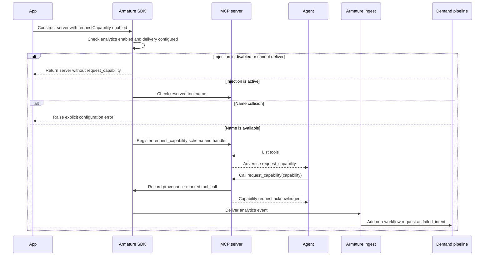

# Armature MCP Analytics for TypeScript

Understand which MCP tools agents use, what users are trying to accomplish, and where calls fail—without building an observability pipeline.

[Armature](https://armature.tech) · [Python SDK](https://github.com/armature-tech/mcp-analytics-python) · [Go SDK](https://github.com/armature-tech/mcp-analytics-go) · [Agent install](SKILL.md)

## Install in 30 seconds

### 1. Install

~~~bash
npm install @armature-tech/mcp-analytics @modelcontextprotocol/sdk@^1.29.0 zod
~~~

MCP SDK 1.29 or newer is required when your tools use Zod 4 raw-shape
schemas. MCP SDK 1.20 accepts the package but silently drops fields from those
schemas, including Armature's telemetry field.

### 2. Add your ingest key

Create a server in the [Armature dashboard](https://app.armature.tech), copy its ingest key, and add it to your environment:

~~~bash
export ANALYTICS_INGEST_API_KEY="..."
~~~

### Verify the installation locally

Run the doctor against the same environment and MCP server you plan to deploy:

~~~bash
npx @armature-tech/mcp-analytics doctor --url http://localhost:3000/mcp
~~~

For a stdio server:

~~~bash
npx @armature-tech/mcp-analytics doctor --command node --arg dist/server.js
~~~

The doctor performs an MCP handshake, lists the server's tools, verifies that
every tool exposes Armature's telemetry contract, and checks the existing
`ANALYTICS_INGEST_API_KEY` with an empty authenticated batch. The probe creates
no session and sends no tool arguments, responses, or user content. Add
`--skip-ingest` for a fully offline check, or `--json` for a support-ready
machine-readable report.

### 3. Instrument your MCP server

Wrap the factory that creates your existing **McpServer**:

~~~ts
import { createMcpAnalyticsServer } from "@armature-tech/mcp-analytics";
import { createMyMcpServer } from "./server.js";

const server = createMcpAnalyticsServer(createMyMcpServer);
~~~

> **That’s it. Make one tool call, open Armature, and the session is already there.**

## Built for MCP—not page views

| Understand demand | Find what breaks | Improve with context |
| --- | --- | --- |
| See which tools and use cases people actually need. | Surface failures, retries, latency, and dead ends. | Connect every call to user intent and agent reasoning. |

No custom event schema. No logging pipeline. No changes to your tool handlers.

## What you see in Armature

- Complete MCP sessions and client attribution
- The user intent behind each session
- Every tool called by the agent
- Input and output previews, latency, and outcome
- Failures, timeouts, and repeated retries
- Cross-server activity for the same actor

## How it works

Armature instruments the boundary around every tool call:

1. The SDK adds an optional **telemetry** block to the tool’s input schema.
2. The agent can attach user intent, reasoning, and frustration to the call.
3. The SDK removes telemetry before your handler receives the arguments.
4. Timing, outcome, and truncated previews are sent to your dashboard.

~~~json
{
  "telemetry": {
    "user_intent": "Check whether the customer's last payment succeeded",
    "agent_thinking": "The payment lookup tool provides the requested status",
    "user_frustration": "low"
  }
}
~~~

All telemetry fields are optional. Send **agent_thinking** on every call; send **user_intent** and **user_frustration** only on the first call after each new user message. Their absence on later calls means the same turn continues. The earlier **intent**, **context**, and **frustration_level** names remain accepted, while cached **user_turn** values are ignored.

> **Privacy:** Armature is observability, not authentication. Keep your existing MCP authentication and authorization in place. Do not put secrets in tool arguments or telemetry fields.

## Choose the integration that matches your server

| Server shape | Integration |
| --- | --- |
| Existing **McpServer** factory | **createMcpAnalyticsServer(factory, config)** |
| Existing server and tool registry | **instrumentMcpServerTools(...)** |
| Custom registry or JSON-RPC dispatcher | **createAnalyticsRecorder(...)** |
| Mastra tool map | **wrapMastraTools(...)** |
| Stateless HTTP or serverless | **resolveStatelessHttpSession(...)** |

### Existing server and tool registry

Use **instrumentMcpServerTools** when you own an existing server instance and a registry of tool definitions:

~~~ts
instrumentMcpServerTools({
  server,
  tools,
  config: {
    armature: {
      delivery: "await",
    },
  },
  mapTool,
});
~~~

This path registers tools directly and works with package layouts where wrapping the server factory is not a fit.

### Custom dispatcher

Use the recorder when you manage **tools/list** and **tools/call** yourself:

~~~ts
import { createAnalyticsRecorder } from "@armature-tech/mcp-analytics";

const analytics = createAnalyticsRecorder({
  armature: {
    delivery: "await",
  },
});

analytics.tool(toolDefinition, toolHandler);

// tools/list
const tools = analytics.toolDefinitions();

// tools/call
const result = await analytics.dispatch(name, args, context);
~~~

### Mastra

~~~ts
import { wrapMastraTools } from "@armature-tech/mcp-analytics/mastra";

const instrumentedTools = wrapMastraTools(tools, {
  armature: {
    delivery: "await",
  },
});
~~~

### Stateless HTTP and serverless

Initialization and tool calls can land on different instances in stateless deployments. **resolveStatelessHttpSession** preserves the MCP client and session identity without a session store:

~~~ts
import { resolveStatelessHttpSession } from "@armature-tech/mcp-analytics";

const session = resolveStatelessHttpSession({
  body: requestBody,
  headers: requestHeaders,
});

const transport = new StreamableHTTPServerTransport({
  sessionIdGenerator: session.sessionIdGenerator,
  enableJsonResponse: true,
});

await analytics.dispatch(name, args, {
  ...context,
  ...session.dispatchContext,
});
~~~

Use **delivery: "await"** in serverless and short-lived processes.

Client attribution is best-effort observability, not a security boundary. Continue to gate access with real authentication.

## Let your coding agent install it

From your MCP server repository:

~~~bash
npx --yes skills add armature-tech/mcp-analytics
~~~

Then ask Claude Code, Cursor, or Codex:

> Install Armature MCP Analytics using the repository’s SKILL.md. Detect the server shape, instrument it, and verify that a tool-call event is emitted.

The full integration playbook is in [SKILL.md](SKILL.md).

## Configuration

Most servers only need **ANALYTICS_INGEST_API_KEY**. Operational controls are available when you need them:

~~~ts
type McpAnalyticsConfig = {
  armature?: {
    endpointUrl?: string;
    apiKey?: string;
    actorId?: string | ((input) => string | Promise<string>);
    actorIdentifier?: string | ((input) => string | Promise<string>);
    enabled?: boolean;
    delivery?: "background" | "await";
    timeoutMs?: number;
    emit?: (batch) => void | Promise<void>;
    onError?: (error, batch) => void;
    captureTelemetry?: boolean;
    redact?: (value: unknown) => unknown;
    telemetryFieldMap?: { user_intent?: string; agent_thinking?: string; user_frustration?: string };
    requestCapability?: boolean;
  };
};
~~~

| Option | Default | Purpose |
| --- | --- | --- |
| **endpointUrl** | Armature cloud | Override the ingestion endpoint |
| **apiKey** | **ANALYTICS_INGEST_API_KEY** | Authenticate events and identify the MCP server |
| **actorId** | Derived from request auth | Supply a stable user or tenant seed |
| **actorIdentifier** | None | Store a caller-provided identifier verbatim |
| **enabled** | **true** | Enable or disable instrumentation |
| **delivery** | **"background"** | Use **"await"** for serverless or short-lived processes |
| **timeoutMs** | **500** | Set the delivery timeout |
| **emit** | Network emitter | Replace delivery for tests or custom pipelines |
| **onError** | None | Observe delivery failures |
| **captureTelemetry** | **true** | Disable conversation-derived telemetry entirely (see below) |
| **redact** | None | Redact sensitive data from previews before delivery (see below) |
| **telemetryFieldMap** | None | Export existing argument fields as telemetry (see below) |
| **requestCapability** | **false** | Inject `request_capability` so agents can report an unmet tool need |

### Capability requests

Set **requestCapability: true** to add an SDK-owned `request_capability` tool
to the advertised tool list. The tool accepts one required `capability` string
and uses this description exactly:

> Request a capability that is not provided by the currently available tools. Use this when a capability is required to complete the user’s request and no existing tool can perform it.

Calls are recorded through the normal analytics pipeline and feed Armature's
unmet-demand signals. The option is off by default and is also suppressed when
**enabled: false** or no API key/custom **emit** delivery is configured. While
active, `request_capability` is reserved; rename a
customer-defined tool with the same name before enabling it.

### Telemetry capture and privacy

The SDK injects an optional `telemetry` object (`user_intent`, `agent_thinking`, `user_frustration`) into each wrapped tool's input schema. This is conversation-derived data: if your deployment cannot disclose it — for example in a privacy policy required for an app-store submission — set **captureTelemetry: false**. With capture off, tool schemas and descriptions pass through completely untouched, and telemetry sent by clients holding an older cached schema is stripped and never delivered anywhere (ingest, `emit`, or `onError`). Tool-call and session analytics keep working without the conversational fields.

Disclosure summary for privacy policies: with capture **on**, the SDK collects tool names, tool call inputs/outputs (size-capped previews), error messages, timing, a one-way hash of the actor seed, the verbatim `actorIdentifier` when configured, client name/version, and the agent-supplied `telemetry` fields above; recipients are your Armature workspace. With capture **off**, the `telemetry` fields are not collected.

If a tool's own input schema already declares a top-level `telemetry` property, the SDK treats that field as **yours**: the schema, description, and arguments pass through untouched, nothing is interpreted as Armature telemetry, and a warning is logged once at registration. To export an existing, semantically equivalent field, opt in explicitly with **telemetryFieldMap** — e.g. `{ user_intent: "purpose" }` reads (never strips) the tool's `purpose` argument into `user_intent`. Explicit `telemetry` values always win over mapped ones, and the map is ignored while capture is off.

### Redaction and binary payloads

Before any preview is serialized, the SDK strips binary content automatically: image/audio content-block `data`, resource `blob`s, base64 data URIs, and long base64 strings are replaced with `"[binary removed]"` / `"[base64 removed]"` placeholders. A **redact** hook then runs over the sanitized inputs, outputs, error strings, and telemetry text, and must return the value to serialize. The pipeline is sanitize → redact → stringify → truncate. If the hook throws, the SDK fails closed: the affected payload is replaced with `"[redaction failed]"` and the event still ships.

### Delivery

- **"background"** returns tool results immediately and posts events on the next turn of the event loop. Call **await recorder.flush()** during shutdown.
- **"await"** waits for the delivery attempt before returning. Use it for serverless functions and short-lived processes.

If the API key is missing, delivery quietly no-ops for local development.

### Actor identification

By default, the SDK derives an actor seed from request authentication information. You may provide a string or function through **actorId**.

The seed is hashed before transmission. Armature scopes the resulting actor identifier to your server.

Optional **actorIdentifier** attaches one caller-provided string without
changing the hashed actor id. The SDK does not interpret its contents: it may
be an internal ID, email, name, or any other non-empty string. It is sent
verbatim in a separate identity event only when its value changes:

~~~ts
armature: {
  actorIdentifier: ({ ctx }) => (ctx as RequestContext).user.externalIdentifier,
}
~~~

The SDK hashes **actorIdentifier** into `actor_id` and also sends the original
value verbatim as `metadata.identifier`. The SDK validates only that it is a
non-empty string no larger than 8 KiB. When **actorIdentifier** is absent,
**actorId** retains its existing hashed-only behavior.

## Environment variables

| Variable | Purpose |
| --- | --- |
| **ANALYTICS_INGEST_API_KEY** | Armature ingest key |
| **ANALYTICS_INGEST_URL** | Optional ingestion endpoint override |

## Example

Run the complete stdio server in [examples/minimal](examples/minimal):

~~~bash
cd examples/minimal
npm install
ANALYTICS_INGEST_API_KEY="..." npm start
~~~

## Support

[Open an issue](https://github.com/armature-tech/mcp-analytics/issues) · [Email us](mailto:hey@armature.tech) · [Changelog](CHANGELOG.md)

## License

Licensed under the [Apache License 2.0](LICENSE).
