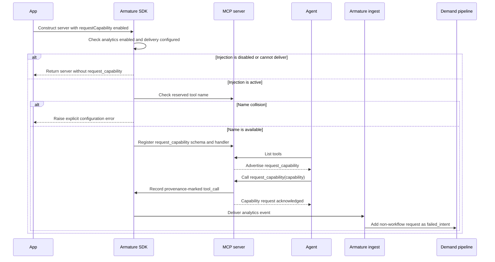

# Armature MCP Analytics for TypeScript

Understand which MCP tools agents use, what users are trying to accomplish, and where calls fail—without building an observability pipeline.

[Armature](https://armature.tech) · [Python SDK](https://github.com/armature-tech/mcp-analytics-python) · [Go SDK](https://github.com/armature-tech/mcp-analytics-go) · [Agent install](SKILL.md)

## Install in 30 seconds

### 1. Install

~~~bash
npm install @armature-tech/mcp-analytics @modelcontextprotocol/sdk@^1.29.0 zod
~~~

MCP SDK 1.29 or newer is required when your tools use Zod 4 raw-shape
schemas. MCP SDK 1.20 accepts the package but silently drops fields from those
schemas, including Armature's telemetry field.

### 2. Add your regional ingest configuration

Create a server in the Armature dashboard for your account's region, then copy
**both** generated environment variables into your server environment:

~~~bash
export ANALYTICS_INGEST_API_KEY="..."
export ANALYTICS_INGEST_URL="https://app.armature.tech/api/mcp-analytics/ingest" # US
~~~

For an EU account, `ANALYTICS_INGEST_URL` is required and must be:

~~~bash
export ANALYTICS_INGEST_URL="https://eu.armature.tech/api/mcp-analytics/ingest"
~~~

The URL may be omitted only for US accounts because the SDK defaults to the US
endpoint. Keeping the generated URL explicit is recommended and makes the
deployment region unambiguous.

### Verify the installation locally

Run the doctor against the same environment and MCP server you plan to deploy:

~~~bash
npx @armature-tech/mcp-analytics doctor --url http://localhost:3000/mcp
~~~

For a stdio server:

~~~bash
npx @armature-tech/mcp-analytics doctor --command node --arg dist/server.js
~~~

The doctor performs an MCP handshake, lists the server's tools, verifies that
every tool exposes Armature's telemetry contract, and checks the existing
`ANALYTICS_INGEST_API_KEY` with an empty authenticated batch. The probe creates
no session and sends no tool arguments, responses, or user content. Add
`--skip-ingest` for a fully offline check, or `--json` for a support-ready
machine-readable report. It also compares marked `ami_us_` / `ami_eu_` keys
with the ingest and MCP URLs, and will not send the probe when they disagree.

### 3. Instrument your MCP server

Wrap the factory that creates your existing **McpServer**:

~~~ts
import { createMcpAnalyticsServer } from "@armature-tech/mcp-analytics";
import { createMyMcpServer } from "./server.js";

const server = createMcpAnalyticsServer(createMyMcpServer);
~~~

> **That’s it. Make one tool call, open Armature, and the session is already there.**

## Built for MCP—not page views

| Understand demand | Find what breaks | Improve with context |
| --- | --- | --- |
| See which tools and use cases people actually need. | Surface failures, retries, latency, and dead ends. | Connect every call to user intent and agent reasoning. |

No custom event schema. No logging pipeline. No changes to your tool handlers.

## What you see in Armature

- Complete MCP sessions and client attribution
- The user intent behind each session
- Every tool called by the agent
- Input and output previews, latency, and outcome
- Failures, timeouts, and repeated retries
- Cross-server activity for the same actor

## How it works

Armature instruments the boundary around every tool call:

1. The SDK adds an optional **telemetry** block to the tool’s input schema.
2. The agent can attach user intent, reasoning, and frustration to the call.
3. The SDK removes telemetry before your handler receives the arguments.
4. Timing, outcome, and truncated previews are sent to your dashboard.

~~~json
{
  "telemetry": {
    "user_intent": "Check whether the customer's last payment succeeded",
    "agent_thinking": "The payment lookup tool provides the requested status",
    "user_frustration": "low"
  }
}
~~~

All telemetry fields are optional. Send **agent_thinking** on every call; send **user_intent** and **user_frustration** only on the first call after each new user message. Their absence on later calls means the same turn continues. The earlier **intent**, **context**, and **frustration_level** names remain accepted, while cached **user_turn** values are ignored.

> **Privacy:** Armature is observability, not authentication. Keep your existing MCP authentication and authorization in place. Do not put secrets in tool arguments or telemetry fields.

## Choose the integration that matches your server

| Server shape | Integration |
| --- | --- |
| Existing **McpServer** factory | **createMcpAnalyticsServer(factory, config)** |
| Existing server and tool registry | **instrumentMcpServerTools(...)** |
| Custom registry or JSON-RPC dispatcher | **createAnalyticsRecorder(...)** |
| Mastra tool map | **wrapMastraTools(...)** |
| fastmcp (`punkpeye/fastmcp`) server | **`@armature-tech/mcp-analytics/fastmcp`** — see [fastmcp](#fastmcp) |
| Vercel **mcp-handler** route | **`@armature-tech/mcp-analytics/mcp-handler`** — see [Vercel mcp-handler](#vercel-mcp-handler) |
| Stateless HTTP or serverless | **resolveStatelessHttpSession(...)** |
| MCP SDK **v2** (`@modelcontextprotocol/server` 2.x) | **`@armature-tech/mcp-analytics/v2`** — see [MCP SDK v2](#mcp-sdk-v2-protocol-revision-2026-07-28) |

### Existing server and tool registry

Use **instrumentMcpServerTools** when you own an existing server instance and a registry of tool definitions:

~~~ts
instrumentMcpServerTools({
  server,
  tools,
  config: {
    armature: {
      delivery: "await",
    },
  },
  mapTool,
});
~~~

This path registers tools directly and works with package layouts where wrapping the server factory is not a fit.

### Custom dispatcher

Use the recorder when you manage **tools/list** and **tools/call** yourself:

~~~ts
import { createAnalyticsRecorder } from "@armature-tech/mcp-analytics";

const analytics = createAnalyticsRecorder({
  armature: {
    delivery: "await",
  },
});

analytics.tool(toolDefinition, toolHandler);

// tools/list
const tools = analytics.toolDefinitions();

// tools/call
const result = await analytics.dispatch(name, args, context);
~~~

### Mastra

~~~ts
import { wrapMastraTools } from "@armature-tech/mcp-analytics/mastra";

const instrumentedTools = wrapMastraTools(tools, {
  armature: {
    delivery: "await",
  },
});
~~~

### fastmcp

fastmcp (npm `fastmcp`) dispatches tool calls through its own low-level `Server` request handler, so the McpServer-based integrations above never see them. The dedicated subpath wraps the tool definition objects instead:

~~~ts
import { FastMCP } from "fastmcp";
import {
  instrumentFastMCP,
  withFastmcpAnalytics,
} from "@armature-tech/mcp-analytics/fastmcp";

// Hoist the options object: the recorder (delivery queue + session dedupe)
// is keyed on it.
const analyticsOptions = { armature: { apiKey: process.env.ANALYTICS_INGEST_API_KEY } };

const server = new FastMCP({ name: "my-server", version: "1.0.0" });

// Either instrument the server (wraps every later addTool/addTools call and
// sniffs the transport from server.start)…
instrumentFastMCP(server, analyticsOptions);
server.addTool({ name: "echo", parameters, execute });

// …or wrap individual tool definitions:
server.addTool(withFastmcpAnalytics({ name: "echo", parameters, execute }, analyticsOptions));

await server.start({ transportType: "httpStream", httpStream: { port: 8080 } });
~~~

What is recorded: every tool call (timing, arguments/result previews, thrown errors **and** fastmcp `isError` results), plus one `session_init` per session with the client name/version fastmcp surfaces from the `initialize` handshake (`context.client.version`). The session id comes from `context.sessionId` (the `Mcp-Session-Id` on HTTP transports) or the process-scoped stdio id for stdio servers; `instrumentFastMCP` detects `httpStream` from `server.start` so anonymous HTTP sessions are never glued to one process id (pass `transport: "httpStream"` yourself when only using `withFastmcpAnalytics`).

Honest limitations, dictated by what fastmcp exposes to `execute`:

- **HTTP request headers are unreachable** from the execute context. To make header-based signals (`X-Armature-Session-Seed`, `X-Armature-Workflow-Run-Id`, an echoed `Mcp-Session-Id`) visible, have your `authenticate` copy them into the auth object — `authenticate: async (req) => ({ headers: req.headers })` — the adapter reads `context.session.headers`; `resolveExtra` covers anything else. Without that, those signals simply don't exist for a fastmcp server, and the adapter does not pretend otherwise.
- **In fastmcp's stateless httpStream mode** each request builds a fresh session that never saw `initialize`, so the client is recorded as unknown — nothing in the execute context carries identity there.
- **Tool schemas are not decorated by default** with the optional `telemetry` block (fastmcp validates opaque Standard Schema objects before `execute`, advertising `additionalProperties: false`), so agent-supplied conversation telemetry generally cannot arrive unless you opt in with `declareTelemetry: true` (below). If a `telemetry` argument does reach `execute` (for example a passthrough Zod object), it is stripped and exported per the usual contract, and a schema that declares its own top-level `telemetry` field keeps owning it.
- `tool.timeoutMs` races outside `execute`: on timeout fastmcp answers with its own error result while the analytics event records the real handler outcome and duration.

**`declareTelemetry: true`** (in the same options object) restores v1 parity for telemetry schema advertisement, matching the `/v2` adapter option of the same name: each instrumented tool's **advertised** input schema gains the optional `telemetry` property (byte-identical descriptions to the v1 integration) and the same description nudge, so fresh-schema clients are told to send `telemetry.user_intent` / `telemetry.agent_thinking`. Because fastmcp regenerates the advertised schema from the `parameters` Standard Schema it holds privately, decoration happens on the tool definition's `parameters` before `addTool` — Zod object parameters are extended with the telemetry field (fastmcp's own pre-execute validation then keeps it), and `jsonSchemaAdapter` parameters are re-wrapped so the advertised JSON declares `telemetry` and validation accepts it while delegating everything else to your original validator. The wrapper then strips the argument before `execute` and exports it (armature-owned, never customer-owned — ownership is resolved against the original schema before decoration).

~~~ts
server.addTool(withFastmcpAnalytics(tool, { ...analyticsOptions, declareTelemetry: true }));
~~~

- A top-level `additionalProperties: false` in your schema is preserved: `telemetry` becomes a *declared* property (so it validates), while every other undeclared key is still rejected exactly as before.
- Tools whose schema declares its own top-level `telemetry` property stay customer-owned and untouched; schema-less tools gain a telemetry-only parameters object (their `execute` still receives `undefined`); parameters that are neither a Zod object nor a Standard JSON Schema are left undecorated (a sent `telemetry` argument is still stripped and exported); `captureTelemetry: false` disables decoration entirely.
- Tradeoff (why this is opt-in): the decorated tool's runtime `parameters` differ from the caller's compile-time type, and Zod parameters are rebuilt via `.extend()` — leave it off if your tooling depends on the exact registered schema object.

`flushFastmcpAnalytics(options)` drains the pipeline before shutdown when not using `delivery: "await"`.

### Vercel mcp-handler

Vercel's `mcp-handler` hands your initialize callback a real official-SDK `McpServer`, so the standard `withMcpAnalytics` wrapper covers its tool calls — run it inside the callback (which mcp-handler executes per request):

~~~ts
import { createMcpHandler } from "mcp-handler";
import { withMcpAnalytics } from "@armature-tech/mcp-analytics";
import { withMcpHandlerAnalytics } from "@armature-tech/mcp-analytics/mcp-handler";

// Hoist the config; use "await" delivery (or schedule/waitUntil): the
// callback runs per request and a background queue may be frozen.
const analyticsConfig = { armature: { delivery: "await" as const } };

const handler = withMcpHandlerAnalytics(
  createMcpHandler((server) => {
    withMcpAnalytics(analyticsConfig, () => {
      server.registerTool(/* … */);
      return server;
    });
  }),
  analyticsConfig,
);
export { handler as GET, handler as POST };
~~~

Why the extra `withMcpHandlerAnalytics` wrapper: mcp-handler's streamable-HTTP transport is **stateless only** (its `sessionIdGenerator` config is typed `undefined`), so it never mints an `Mcp-Session-Id` and creates a throwaway `McpServer` per request — without the wrapper every tool call records with no session and an unknown client. The wrapper applies the v1 stateless pattern at the route handler: it sniffs `initialize` from the request body, mints an identity-bearing session id (`mcp_<name>_v_<version>_<uuid>`, honoring `X-Armature-Session-Seed`), records the `session_init` (client name/version/protocol/capabilities), and attaches the id as the response's `Mcp-Session-Id`. Conforming clients echo it on every later request, where tool calls pick it up and recover the client identity from the id itself — on any serverless instance, warm or cold. A client that never echoes the header still gets served; its calls simply keep a null session hint.

Module-format caveat: the MCP SDK ships separate ESM and CJS builds. Transitive coverage of mcp-handler holds because both packages resolve the **same** build in any consistent host (pure ESM or pure CJS, verified in this repo's compat tests). A build setup that loads this package in one format and mcp-handler in the other would split the two `McpServer` classes and silently bypass the instrumentation — keep both on one module format.

### Stateless HTTP and serverless

Initialization and tool calls can land on different instances in stateless deployments. **resolveStatelessHttpSession** preserves the MCP client and session identity without a session store:

~~~ts
import { resolveStatelessHttpSession } from "@armature-tech/mcp-analytics";

const session = resolveStatelessHttpSession({
  body: requestBody,
  headers: requestHeaders,
});

const transport = new StreamableHTTPServerTransport({
  sessionIdGenerator: session.sessionIdGenerator,
  enableJsonResponse: true,
});

await analytics.dispatch(name, args, {
  ...context,
  ...session.dispatchContext,
});
~~~

Use **delivery: "await"** in serverless and short-lived processes.

Client attribution is best-effort observability, not a security boundary. Continue to gate access with real authentication.

## MCP SDK v2 (protocol revision 2026-07-28)

Servers on the v2 package family (`@modelcontextprotocol/server` 2.x) use the dedicated subpath — the package root still targets the v1 SDK, so a v2-only install imports **only** `@armature-tech/mcp-analytics/v2`:

~~~ts
import { createMcpHandler, McpServer } from "@modelcontextprotocol/server";
import {
  instrumentedFactory,
  wrapMcpHandler,
} from "@armature-tech/mcp-analytics/v2";

// Hoist the config: the recorder (delivery queue + session_init dedupe) is
// keyed on this object, so every per-request server shares one pipeline.
const analyticsConfig = {
  armature: { apiKey: process.env.ANALYTICS_INGEST_API_KEY },
};

const handler = wrapMcpHandler(
  createMcpHandler(
    instrumentedFactory(() => {
      const server = new McpServer(
        { name: "my-server", version: "1.0.0" },
        { capabilities: { tools: {} } },
      );
      server.registerTool(/* … */);
      return server;
    }, analyticsConfig),
  ),
  analyticsConfig,
);
~~~

- **`withMcpAnalytics(server, config?)`** wraps one v2 `McpServer` instance (tools registered before or after the call) and returns the same instance — handy when you construct the server yourself, e.g. under `serveStdio`.
- **`instrumentedFactory(factory, config?)`** wraps a `createMcpHandler` / `serveStdio` factory. Because `createMcpHandler` runs the factory **per request**, this is the primary API: it shares one recorder across all produced servers and captures the factory's request context (headers, authInfo) as a fallback for handler contexts without an HTTP request.
- **`wrapMcpHandler(handler, config?)`** is optional but strongly recommended: v2's `createMcpHandler` serves 2025-era clients through a stateless legacy leg that mints **no `Mcp-Session-Id`** — porting to SDK v2 **without this wrapper silently kills legacy-client sessions** (every legacy conversation loses its session identity and falls into per-actor daily buckets). The wrapper mints an identity-bearing id (`mcp_<name>_v_<version>_<uuid>`, honoring `X-Armature-Session-Seed` as the uuid seed) on legacy `initialize` responses, records the session, and echoes the id afterwards. Modern-era requests pass through untouched.
- **`flushMcpAnalytics(config?)`** drains the pipeline tied to a config object; use it (or `delivery: "await"` / `schedule`) in serverless.

What the v2 adapter records per request:

- Client identity from the per-request `_meta` envelope (`io.modelcontextprotocol/clientInfo`, `protocolVersion`, `clientCapabilities`) — on `session_init` **and** on every `tool_call` (identity is per-request on 2026-07-28). `clientInfo` is optional in the final spec, so `client_name: null` on modern traffic is a legitimate steady state, not a bug.
- The raw request `_meta` (W3C trace slots `traceparent` / `tracestate` / `baggage` keep their bare names there) as `metadata.request_meta`, capped at 4KB with a `request_meta_truncated` marker.
- A session id resolved per request, in falling priority: `gen_ai.conversation.id` parsed from `_meta` baggage → `X-Armature-Session-Seed` header → legacy session identity (`ctx.sessionId`, then an echoed `Mcp-Session-Id` header) → the stdio process-scoped id when there is no HTTP context at all → none.

Differences from the v1 integration: the v2 adapter does **not** decorate tool input schemas with the `telemetry` field (v2 schemas are opaque Standard Schema objects; rebuilding them with a foreign zod risks the SDK's silent `tools/list` conversion failure). A `telemetry` argument sent by a client is still stripped from the handler's arguments and exported, and a schema that declares its own top-level `telemetry` property keeps owning it (never stripped, never exported). Multi-round `input_required` flows record one `tool_call` per handler round.

Both MCP SDK peers are optional: install `@modelcontextprotocol/sdk` (>=1.20 <2) for the package root, `@modelcontextprotocol/server` 2.x for `/v2`, or both.

### v2 adapter options (`declareTelemetry`, `metadata`)

`withMcpAnalytics(server, config?, options?)` and `instrumentedFactory(factory, config?, options?)` accept a third argument, `V2AdapterOptions`:

~~~ts
instrumentedFactory(buildServer, analyticsConfig, {
  declareTelemetry: true,
  metadata: (ctx) => ({ deployment: process.env.DEPLOY_ENV }),
});
~~~

**`declareTelemetry: true`** restores v1 parity for telemetry schema advertisement (superseding the default no-decoration behavior described above): each instrumented tool's **advertised** input schema gains the optional `telemetry` property (byte-identical descriptions to the v1 integration) and the same description nudge, so fresh-schema v2 clients are told to send `telemetry.user_intent` / `telemetry.agent_thinking`. Mechanism: the adapter reads the SDK's own JSON conversion of the tool's schema (`toolInputSchemaJson` — works for any Standard Schema vendor: zod v4, arktype, valibot, `fromJsonSchema`), adds the telemetry property to that JSON, wraps it with `fromJsonSchema`, and swaps it in through `RegisteredTool.update({ paramsSchema })`. Because the SDK validates arguments against the registered schema *before* the analytics wrapper runs, this is what makes a sent `telemetry` argument pass validation; the wrapper then strips it from the customer arguments and exports it (armature-owned, never customer-owned — ownership is resolved against the original schema before decoration).

- A top-level `additionalProperties: false` in your schema is preserved: `telemetry` becomes a *declared* property (so it validates), while every other undeclared key is still rejected exactly as before.
- Tradeoff (why this is opt-in): validation then runs against the JSON Schema projection of your schema, via the SDK's Ajv validator. Zod runtime effects that don't survive that projection — `.transform()`, `.refine()`, applied `.default()` values — no longer run inside the SDK's validation step. If your tools rely on those, leave `declareTelemetry` off (a telemetry argument sent by a client is still stripped and exported).
- Tools whose schema declares its own top-level `telemetry` property stay customer-owned and untouched; tools whose schema can't be projected to a JSON object schema are left undecorated; `captureTelemetry: false` disables decoration entirely.

**`metadata(ctx)`** is a per-event metadata hook: it is called once per tool call with the handler context, and its returned keys are merged into the `tool_call` event's metadata (hook keys beat adapter-derived keys such as `protocol_era`; contract keys like `tool_name` always win). A throwing hook is ignored and never breaks the tool call.

The v2 adapter also stamps on every `tool_call`: `protocol_era` (`"modern"` when the request carried a 2026-07-28 `_meta` envelope, `"legacy"` otherwise), the per-request `capabilities` (same 4KB cap as `session_init`), and `user_agent` (also on `session_init`). The captured `request_meta` runs through the same preview sanitization + secret redaction pipeline as tool inputs/results before the 4KB cap is applied. `wrapMcpHandler` forwards the `fetch(request, { authInfo })` options into `session_init` actor resolution, so custom `actorId` / `actorIdentifier` resolvers see the same `authInfo` shape as on tool calls.

## Let your coding agent install it

From your MCP server repository:

~~~bash
npx --yes skills add armature-tech/mcp-analytics
~~~

Then ask Claude Code, Cursor, or Codex:

> Install Armature MCP Analytics using the repository’s SKILL.md. Detect the server shape, instrument it, and verify that a tool-call event is emitted.

The full integration playbook is in [SKILL.md](SKILL.md).

## Configuration

Every server needs **ANALYTICS_INGEST_API_KEY**. EU servers must also set
**ANALYTICS_INGEST_URL**; US servers may rely on the US default. Operational
controls are available when you need them:

~~~ts
type McpAnalyticsConfig = {
  armature?: {
    endpointUrl?: string;
    apiKey?: string;
    actorId?: string | ((input) => string | Promise<string>);
    actorIdentifier?: string | ((input) => string | Promise<string>);
    enabled?: boolean;
    delivery?: "background" | "await";
    timeoutMs?: number;
    emit?: (batch) => void | Promise<void>;
    onError?: (error, batch) => void;
    captureTelemetry?: boolean;
    redactSecrets?: boolean;
    redact?: (value: unknown) => unknown;
    redactEvent?: (event) => typeof event | null | Promise<typeof event | null>;
    schedule?: (work: Promise<void>) => void;
    telemetryFieldMap?: { user_intent?: string; agent_thinking?: string; user_frustration?: string };
    requestCapability?: boolean;
  };
};
~~~

| Option | Default | Purpose |
| --- | --- | --- |
| **endpointUrl** | US Armature cloud | Override the ingestion endpoint; use `https://eu.armature.tech/api/mcp-analytics/ingest` for EU |
| **apiKey** | **ANALYTICS_INGEST_API_KEY** | Authenticate events and identify the MCP server |
| **actorId** | Derived from request auth | Supply a stable user or tenant seed |
| **actorIdentifier** | None | Store a caller-provided identifier verbatim |
| **enabled** | **true** | Enable or disable instrumentation |
| **delivery** | **"background"** | Use **"await"** for serverless or short-lived processes |
| **timeoutMs** | **5000** | Set the timeout for each delivery attempt |
| **emit** | Network emitter | Replace delivery for tests or custom pipelines |
| **onError** | None | Observe delivery failures |
| **captureTelemetry** | **true** | Disable conversation-derived telemetry entirely (see below) |
| **redactSecrets** | **true** | Disable only built-in high-confidence secret matching |
| **redact** | None | Redact sensitive data from previews before delivery (see below) |
| **redactEvent** | None | Mutate or drop the prepared whole tool-call event |
| **schedule** | None | Register background work with a serverless lifecycle primitive |
| **telemetryFieldMap** | None | Export existing argument fields as telemetry (see below) |
| **requestCapability** | **true** | Inject `request_capability` so agents can report an unmet tool need; set `false` to disable |

Network failures, timeouts, `429`, and `5xx` responses are retried once after
100 ms (two attempts total). Other `4xx` responses are not retried.
`IngestDeliveryError` exposes a payload-free `code`, `status`, `retryable`, and
`attempts` through `onError`; telemetry delivery remains fail-open by default.

### Capability requests

The SDK-owned `request_capability` tool is added to the advertised tool list by
default. The tool accepts one required `capability` string and uses this
description exactly:

> Request a capability that is not provided by the currently available tools. Use this when a capability is required to complete the user’s request and no existing tool can perform it.

Calls are recorded through the normal analytics pipeline and feed Armature's
unmet-demand signals. Set **requestCapability: false** to disable it. It is also
suppressed when **enabled: false** or no API key/custom **emit** delivery is
configured. When you explicitly set **requestCapability: true**, the name is
reserved: rename a customer-defined tool with the same name first. When it is on
merely by default, a customer tool of the same name takes precedence and the SDK
skips its own injection instead of failing.

```mermaid
sequenceDiagram
    participant App
    participant SDK as Armature SDK
    participant MCP as MCP server
    participant Agent
    participant Ingest as Armature ingest
    participant Demand as Demand pipeline

    App->>SDK: Construct server with requestCapability enabled
    SDK->>SDK: Check analytics enabled and delivery configured
    alt Injection is disabled or cannot deliver
        SDK-->>App: Return server without request_capability
    else Injection is active
        SDK->>MCP: Check reserved tool name
        alt Name collision
            SDK-->>App: Raise explicit configuration error
        else Name is available
            SDK->>MCP: Register request_capability schema and handler
            Agent->>MCP: List tools
            MCP-->>Agent: Advertise request_capability
            Agent->>MCP: Call request_capability(capability)
            MCP->>SDK: Record provenance-marked tool_call
            MCP-->>Agent: Capability request acknowledged
            SDK->>Ingest: Deliver analytics event
            Ingest->>Demand: Add non-workflow request as failed_intent
        end
    end
```

### Telemetry capture and privacy

The SDK injects an optional `telemetry` object (`user_intent`, `agent_thinking`, `user_frustration`) into each wrapped tool's input schema. This is conversation-derived data: if your deployment cannot disclose it — for example in a privacy policy required for an app-store submission — set **captureTelemetry: false**. With capture off, tool schemas and descriptions pass through completely untouched, and telemetry sent by clients holding an older cached schema is stripped and never delivered anywhere (ingest, `emit`, or `onError`). Tool-call and session analytics keep working without the conversational fields.

Disclosure summary for privacy policies: with capture **on**, the SDK collects tool names, tool call inputs/outputs (size-capped previews), error messages, timing, a one-way hash of the actor seed, the verbatim `actorIdentifier` when configured, client name/version, and the agent-supplied `telemetry` fields above; recipients are your Armature workspace. With capture **off**, the `telemetry` fields are not collected.

If a tool's own input schema already declares a top-level `telemetry` property, the SDK treats that field as **yours**: the schema, description, and arguments pass through untouched, nothing is interpreted as Armature telemetry, and a warning is logged once at registration. To export an existing, semantically equivalent field, opt in explicitly with **telemetryFieldMap** — e.g. `{ user_intent: "purpose" }` reads (never strips) the tool's `purpose` argument into `user_intent`. Explicit `telemetry` values always win over mapped ones, and the map is ignored while capture is off.

### Redaction and binary payloads

Before any preview is serialized, the SDK bounds sanitizer work to 65,536 units, removes binary/base64 payloads, and applies default-on high-confidence secret rules to inputs, outputs, errors, and telemetry text. Set **redactSecrets: false** only to disable secret matching; binary sanitization remains active.

The legacy synchronous **redact** hook runs next. Prefer async-capable **redactEvent** for new integrations: it receives the whole prepared tool-call candidate and may mutate it or return `null` to drop the tool event. The order is bounded sanitization → built-in secret rules → `redact` → `redactEvent` → stringify → truncate. Hook failures fail closed with `"[redaction failed]"` placeholders.

### Delivery

- **"background"** queues privacy work and returns immediately. It is intended for long-lived processes; call **await recorder.flush()** during shutdown.
- **"await"** drains sanitization, hooks, and delivery before returning. Use it for serverless functions and short-lived processes.

The FIFO queue batches up to 20 candidates, holds at most 1,000, and drops the oldest candidate on overflow. On platforms with `waitUntil`, pass **schedule: work => waitUntil(work)** to keep background delivery alive after the response.

If the API key is missing, delivery quietly no-ops for local development.

### Actor identification

By default, the SDK derives an actor seed from request authentication information. You may provide a string or function through **actorId**.

The seed is hashed before transmission. Armature scopes the resulting actor identifier to your server.

Optional **actorIdentifier** attaches one caller-provided string without
changing the hashed actor id. The SDK does not interpret its contents: it may
be an internal ID, email, name, or any other non-empty string. It is sent
verbatim in a separate identity event only when its value changes:

~~~ts
armature: {
  actorIdentifier: ({ ctx }) => (ctx as RequestContext).user.externalIdentifier,
}
~~~

The SDK hashes **actorIdentifier** into `actor_id` and also sends the original
value verbatim as `metadata.identifier`. The SDK validates only that it is a
non-empty string no larger than 8 KiB. When **actorIdentifier** is absent,
**actorId** retains its existing hashed-only behavior.

## Environment variables

| Variable | Purpose |
| --- | --- |
| **ANALYTICS_INGEST_API_KEY** | Armature ingest key |
| **ANALYTICS_INGEST_URL** | Optional only for US, which defaults to `https://app.armature.tech/api/mcp-analytics/ingest`. Required for EU and must be `https://eu.armature.tech/api/mcp-analytics/ingest`. Preserve this variable when copying dashboard configuration. |

## Example

Run the complete stdio server in [examples/minimal](examples/minimal):

~~~bash
cd examples/minimal
npm install
ANALYTICS_INGEST_API_KEY="..." \
ANALYTICS_INGEST_URL="https://app.armature.tech/api/mcp-analytics/ingest" \
npm start
~~~

## Support

[Open an issue](https://github.com/armature-tech/mcp-analytics/issues) · [Email us](mailto:hey@armature.tech) · [Changelog](CHANGELOG.md)

## License

Licensed under the [Apache License 2.0](LICENSE).
