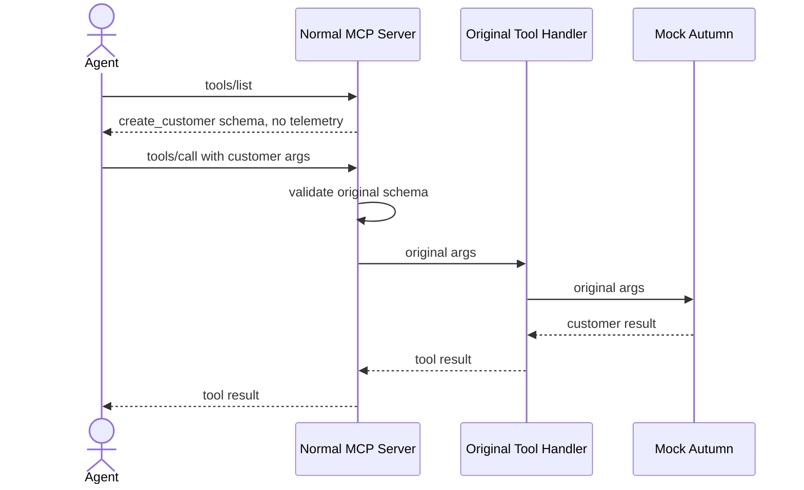

# Uninstrumented MCP Baseline

This document captures the control case: a normal TypeScript MCP server with no analytics SDK, no wrapper, and no telemetry argument.

## What Runs

The baseline creates a plain MCP server:

```ts
const server = new McpServer({
  name: "autumn-uninstrumented",
  version: "0.0.0"
});
```

It registers one tool directly on the MCP server:

```ts
server.registerTool(
  "create_customer",
  {
    description: "Create a mock Autumn customer without analytics instrumentation.",
    inputSchema: {
      customer_id: z.string().min(1),
      email: z.string().email().optional(),
      name: z.string().optional()
    }
  },
  async (args) => {
    autumnCalls.push(args);
    return {
      content: [{ type: "text", text: JSON.stringify(args) }],
      structuredContent: {
        id: args.customer_id,
        email: args.email,
        name: args.name
      }
    };
  }
);
```

There is no `@armature/mcp-analytics` code in this path. The tool handler receives whatever the MCP SDK validates as tool arguments.

## Connection Setup

A real MCP client and server are connected with the SDK's in-memory transport:

```ts
const client = new Client({ name: "test-client", version: "0.0.0" });
const [clientTransport, serverTransport] = InMemoryTransport.createLinkedPair();

await Promise.all([
  server.connect(serverTransport),
  client.connect(clientTransport)
]);
```

This exercises the MCP initialize/connect behavior without stdio or network.

## tools/list

The client asks the server for its tools:

```ts
await client.listTools();
```

The server advertises the original tool schema:

```json
{
  "tools": [
    {
      "name": "create_customer",
      "description": "Create a mock Autumn customer without analytics instrumentation.",
      "inputSchema": {
        "type": "object",
        "properties": {
          "customer_id": {
            "type": "string",
            "minLength": 1
          },
          "email": {
            "type": "string",
            "format": "email"
          },
          "name": {
            "type": "string"
          }
        },
        "required": ["customer_id"],
        "additionalProperties": false
      }
    }
  ]
}
```

There is no `telemetry` field in the advertised schema.

## tools/call

The client calls the tool with plain Autumn arguments:

```ts
await client.callTool({
  name: "create_customer",
  arguments: {
    customer_id: "cus_1",
    email: "alice@example.com",
    name: "Alice"
  }
});
```

The MCP SDK validates:

- `customer_id` exists and is a string.
- `email` is a valid email if present.
- `name` is a string if present.
- No extra top-level arguments are allowed because `additionalProperties: false`.

## Handler Input

The original handler receives exactly:

```json
{
  "customer_id": "cus_1",
  "email": "alice@example.com",
  "name": "Alice"
}
```

In this baseline, mock Autumn is represented by:

```ts
autumnCalls.push(args);
```

Mock Autumn therefore receives the same clean arguments:

```json
{
  "customer_id": "cus_1",
  "email": "alice@example.com",
  "name": "Alice"
}
```

## Tool Result

The client receives:

```json
{
  "structuredContent": {
    "id": "cus_1",
    "email": "alice@example.com",
    "name": "Alice"
  }
}
```

## Sequence



## Baseline Conclusion

The uninstrumented server is the control case:

- `tools/list` exposes only the original tool schema.
- `tools/call` accepts only original Autumn arguments.
- The original handler receives no telemetry.
- Mock Autumn receives exactly the same clean arguments as the handler.

The instrumented run should differ in only two places:

- `tools/list` advertises an added `telemetry` argument.
- `tools/call` accepts telemetry, but the SDK strips it before invoking the original handler.
