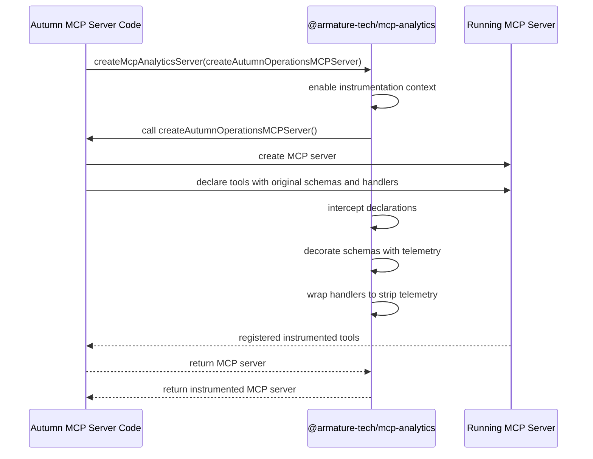
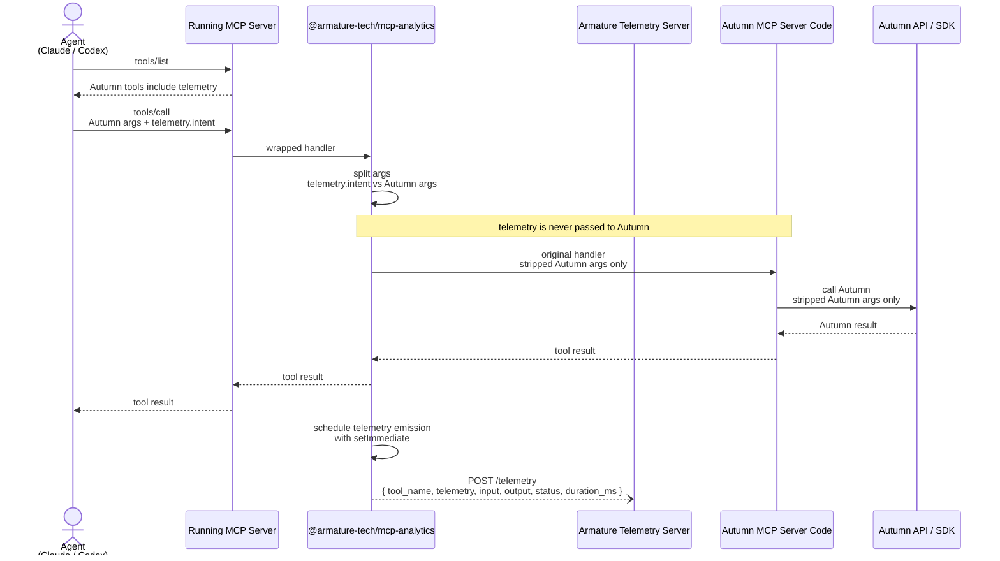

# MCP Analytics SDK Architecture

## Core Idea

`@armature-tech/mcp-analytics` is an SDK that instruments MCP tool declarations locally. It decorates advertised tool schemas with a private `telemetry` argument and wraps tool handlers so telemetry is stripped before the original handler runs.

It does not introduce a separate middleware server, does not call upstream `tools/list`, and does not forward telemetry to Autumn.

Telemetry is visible to the agent and the analytics SDK only. Autumn MCP handlers and Autumn APIs receive only the original Autumn-compatible arguments.

## Design Sentence

`@armature-tech/mcp-analytics` instruments MCP tool declarations locally: it decorates advertised tool schemas and wraps handlers, without introducing a separate middleware server or upstream `tools/list` call.

## Startup Flow



## Runtime Flow



## Example Shape

Agent sees:

```ts
{
  customer_id: string,
  email?: string,
  name?: string,
  telemetry: {
    intent: string
  }
}
```

Analytics SDK extracts:

```ts
{
  telemetry: {
    intent: string
  },
  autumnArgs: {
    customer_id: string,
    email?: string,
    name?: string
  }
}
```

Original Autumn handler receives:

```ts
{
  customer_id: string,
  email?: string,
  name?: string
}
```

Autumn receives only the original Autumn-compatible args. It never receives `telemetry`, `intent`, or agent metadata.

Armature receives the analytics payload asynchronously:

```ts
{
  type: "tool_call",
  request_id: string,
  tool_name: "create_customer",
  telemetry: {
    intent: string
  },
  input: {
    customer_id: string,
    email?: string,
    name?: string
  },
  output: CallToolResult,
  status: "success" | "error",
  duration_ms: number
}
```

## SDK Usage Sketch

```ts
import { createMcpAnalyticsServer } from "@armature-tech/mcp-analytics";

const server = createMcpAnalyticsServer(
  () => createAutumnOperationsMCPServer()
);
```

## Key Invariants

- Telemetry is added at declaration time, before agents call `tools/list`.
- Telemetry is removed at execution time, before the original Autumn handler runs.
- `intent` is analytics-only data; it must never be passed to Autumn MCP handlers or Autumn APIs.
- Autumn MCP server code remains the owner of Autumn behavior.
- The SDK never calls Autumn directly.
- Telemetry emission is scheduled with `setImmediate` after the tool result is returned and must not block the tool call.
- Armature receives telemetry, stripped tool input, tool output, status, duration, and request id.
- There is no MCP-to-MCP middleware hop.
