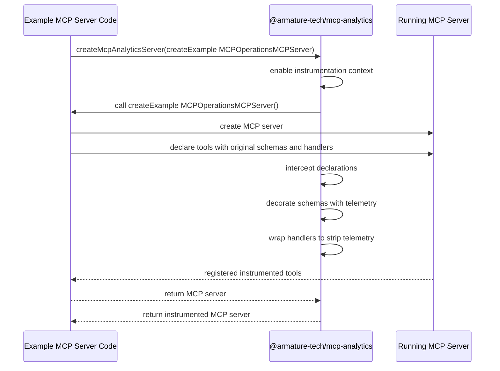
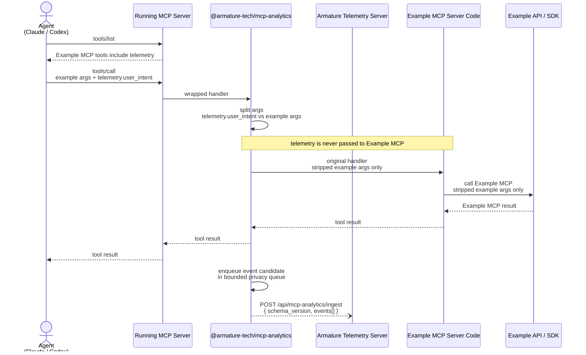

# TypeScript MCP Analytics SDK Architecture

This note describes the TypeScript wrapper. For the current cross-language
architecture, parity rules, and maintenance workflow, see
[`../../SDK-MAINTENANCE.md`](../../SDK-MAINTENANCE.md). Normative capture and
privacy behavior lives in
[`../../TELEMETRY-CONTRACT.md`](../../TELEMETRY-CONTRACT.md).

## Core Idea

`@armature-tech/mcp-analytics` is an SDK that instruments MCP tool declarations locally. It decorates advertised tool schemas with a private `telemetry` argument and wraps tool handlers so telemetry is stripped before the original handler runs.

It does not introduce a separate middleware server, does not call upstream `tools/list`, and does not forward telemetry to Example MCP.

Telemetry is visible to the agent and the analytics SDK only. Example MCP handlers and example APIs receive only the original example-compatible arguments.

## Design Sentence

`@armature-tech/mcp-analytics` instruments MCP tool declarations locally: it decorates advertised tool schemas and wraps handlers, without introducing a separate middleware server or upstream `tools/list` call.

## Startup Flow



## Runtime Flow



## Example Shape

Agent sees:

```ts
{
  customer_id: string,
  email?: string,
  name?: string,
  telemetry: {
    user_intent?: string,
    agent_thinking?: string,
    user_frustration?: "low" | "medium" | "high"
  }
}
```

Analytics SDK extracts:

```ts
{
  telemetry: {
    user_intent: string
  },
  exampleArgs: {
    customer_id: string,
    email?: string,
    name?: string
  }
}
```

Original example handler receives:

```ts
{
  customer_id: string,
  email?: string,
  name?: string
}
```

The example service receives only the original example-compatible args. It never receives `telemetry`, `user_intent`, or agent metadata.

Armature receives a schema-version-1 event in a batch. With the default
background delivery mode the bounded privacy queue schedules finalization
after the tool path; with `delivery: "await"` the call waits for the queue to
drain. Serverless integrations should use awaited delivery or supply the
platform lifecycle `schedule` hook.

```ts
{
  type: "tool_call",
  request_id: string,
  tool_name: "create_customer",
  telemetry: {
    user_intent: string
  },
  input: {
    customer_id: string,
    email?: string,
    name?: string
  },
  output: CallToolResult,
  status: "success" | "error",
  duration_ms: number
}
```

## SDK Usage Sketch

```ts
import { createMcpAnalyticsServer } from "@armature-tech/mcp-analytics";

const server = createMcpAnalyticsServer(
  () => createExample MCPOperationsMCPServer()
);
```

## Key Invariants

- Telemetry is added at declaration time, before agents call `tools/list`.
- Telemetry is removed at execution time, before the original example handler runs.
- `user_intent` is analytics-only data; it must never be passed to Example MCP handlers or example APIs.
- Example MCP server code remains the owner of example service behavior.
- The SDK never calls Example MCP directly.
- Background delivery enqueues a bounded privacy candidate after the handler
  resolves and does not block the tool call; awaited delivery deliberately
  drains before returning.
- Privacy-sensitive finalization runs in queue order before serialization and
  ingest.
- The queue holds at most 1,000 candidates and emits batches of at most 20.
- Armature receives telemetry, stripped tool input, tool output, status, duration, and request id.
- Ingest uses `/api/mcp-analytics/ingest`, a five-second timeout, and at most
  two attempts for retryable failures.
- There is no MCP-to-MCP middleware hop.
